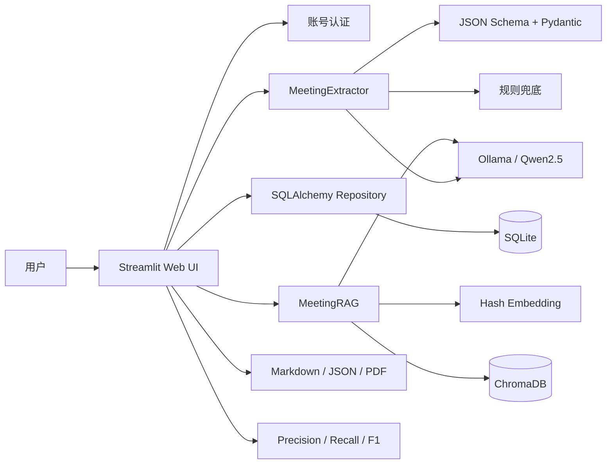

# Meeting Copilot 智能会议纪要系统

Meeting Copilot 是一个基于 **Python、Streamlit、Ollama、ChromaDB 与 SQLite** 构建的本地智能会议工作台，将非结构化会议记录转换为可编辑、可检索、可追问的结构化知识资产，并以本地大模型、RAG、知识图谱和待办看板构成完整的智能会议工作流。

本项目面向 NLP / 深度学习综合实践课程设计，完整覆盖 **Prompt Engineering、JSON Schema 结构化输出、Pydantic 校验、RAG、向量检索、数据持久化、效果评估与 Web 工程实践**。

## 功能概览

- **账号与数据隔离**：支持注册、登录和退出；每个账号只能访问自己的会议、待办和问答数据。
- **多种文本输入**：支持直接粘贴会议记录、加载内置样例、上传 TXT / Markdown 转写文本。
- **智能纪要生成**：通过 Ollama + Qwen2.5 提取主题、日期、参会人、议题、讨论要点、决议和 Action Items。
- **可靠结构化输出**：使用 JSON Schema 约束模型输出，并通过 Pydantic 校验、JSON 修复和规则兜底提高稳定性。
- **编辑与导出**：支持编辑结构化 JSON 和 Markdown，导出 Markdown、JSON、PDF。
- **历史会议管理**：支持搜索、查看和删除会议，会议数据持久化保存在 SQLite。
- **会议知识图谱**：以蓝紫色关系图展示会议、议题、人员、决议与待办之间的联系。
- **待办看板**：按待办、进行中、已完成、延期、取消分类管理任务，状态修改后写回数据库。
- **跨会议 RAG 问答**：将纪要切块后存入 ChromaDB，支持相似度检索、Top-K 召回和带来源回答。
- **效果评估**：支持上传系统输出与人工标注 JSON，计算 Precision、Recall、F1；项目还包含 RAG 与 LLM-as-Judge 实验脚本。

## 系统架构



### 数据流

1. 用户登录后粘贴或上传会议转写文本。
2. `MeetingExtractor` 调用 Qwen2.5，并使用 `MeetingMinutes` JSON Schema 约束输出。
3. Pydantic 校验结果；模型不可用或结果异常时可启用规则兜底。
4. 纪要、决议和待办通过 SQLAlchemy 写入 SQLite。
5. Markdown 纪要被切分、向量化并写入 ChromaDB。
6. 用户提问时，系统检索相关会议片段，再由 Qwen2.5 生成带来源回答。

## 技术栈

| 层级 | 技术 |
|---|---|
| Web 界面 | Streamlit |
| 大语言模型 | Ollama + Qwen2.5 |
| 结构化输出 | JSON Schema + Pydantic v2 |
| ORM / 数据库 | SQLAlchemy + SQLite |
| 向量数据库 | ChromaDB |
| Embedding | 384 维本地 Hash Embedding |
| RAG | Chunking + Similarity Search + Top-K + Prompt |
| 导出 | Markdown / JSON / ReportLab PDF |
| 测试与评估 | pytest + Precision / Recall / F1 + LLM-as-Judge |

## 项目结构

```text
meeting-copilot/
├── app.py                         # Streamlit 首页与登录入口
├── auth_ui.py                     # 登录、注册、会话状态
├── config.py                      # 模型、数据库、RAG 参数
├── ui.py                          # 全局视觉样式与通用组件
├── requirements.txt               # Python 依赖
│
├── pages/
│   ├── 1_generate_minutes.py      # 纪要生成、编辑与导出
│   ├── 2_history.py               # 历史会议、知识图谱、待办看板
│   ├── 3_meeting_qa.py            # 跨会议 RAG 问答
│   ├── 4_evaluation.py            # 抽取结果评估
│   └── 5_settings.py              # 模型与系统设置
│
├── services/
│   ├── meeting_extractor.py       # LLM 提取、解析、校验与兜底
│   ├── meeting_schema.py          # MeetingMinutes Pydantic 模型
│   ├── meeting_rag.py             # ChromaDB 存储、检索与问答
│   ├── meeting_insights.py        # 知识图谱与待办看板
│   ├── embedding_service.py       # 本地 Hash Embedding
│   ├── ollama_client.py           # Ollama HTTP 客户端
│   ├── export_service.py          # Markdown / JSON / PDF 导出
│   └── evaluation_service.py      # Precision / Recall / F1
│
├── database/
│   ├── models.py                  # SQLAlchemy 数据模型
│   ├── repository.py              # 数据访问与账号权限校验
│   ├── sqlite.py                  # 连接、建表与兼容迁移
│   └── meeting_copilot.db         # 本地运行后生成，不提交 Git
│
├── prompts/                       # 提取、修复、RAG、评估 Prompt
├── data/                          # 样例、人工标注与评估问题
├── chroma_db/                     # 本地向量索引，不提交 Git
├── exports/                       # 导出的纪要文件
├── tests/                         # pytest 测试
└── docs/                          # 项目文档
```

## 环境要求

- Python 3.10 或更高版本
- Ollama
- 推荐至少 8 GB 内存
- Windows、macOS、Linux 均可运行
- GPU 非必需；CPU 可以运行 Qwen2.5 小模型，但速度较慢

## 安装配置

### 1. 获取项目

```bash
git clone https://github.com/wifihhhhh/meeting-copilot.git
cd meeting-copilot
```

也可以直接下载仓库 ZIP，解压后进入项目根目录。

### 2. 创建虚拟环境

Windows PowerShell：

```powershell
python -m venv .venv
.\.venv\Scripts\Activate.ps1
```

如果 PowerShell 阻止执行激活脚本，可仅对当前终端临时放行：

```powershell
Set-ExecutionPolicy -Scope Process Bypass
.\.venv\Scripts\Activate.ps1
```

macOS / Linux：

```bash
python3 -m venv .venv
source .venv/bin/activate
```

### 3. 安装 Python 依赖

```bash
python -m pip install --upgrade pip
python -m pip install -r requirements.txt
```

`requirements.txt` 已包含 ChromaDB。如果只需要单独安装：

```bash
python -m pip install chromadb
```

### 4. 安装并准备 Ollama

从 [Ollama 官网](https://ollama.com/) 安装 Ollama，然后拉取模型：

```bash
ollama pull qwen2.5:1.5b
```

开发与低配置电脑推荐 `qwen2.5:1.5b`。正式演示、内存充足时可使用：

```bash
ollama pull qwen2.5:7b
```

确认 Ollama 服务和模型：

```bash
ollama list
ollama serve
```

Windows / macOS 的 Ollama 桌面程序通常会自动启动服务；如果提示端口已被占用，通常表示服务已经运行，无需重复执行 `ollama serve`。

## 运行方式

在项目根目录执行：

```bash
streamlit run app.py
```

终端出现以下提示后，在浏览器访问显示的地址：

```text
You can now view your Streamlit app in your browser.
Local URL: http://localhost:8501
```

如果 8501 端口被占用：

```bash
streamlit run app.py --server.port 8502
```

### 关闭服务

在运行 Streamlit 的终端按：

```text
Ctrl + C
```

如果终端已经关闭，可在 PowerShell 中查找并结束进程：

```powershell
Get-Process streamlit,python -ErrorAction SilentlyContinue
Stop-Process -Id <进程ID>
```

## 使用流程

1. 打开应用并注册本地账号。
2. 进入“生成会议纪要”，选择样例、粘贴文本或上传 TXT / Markdown。
3. 选择 Ollama 模型，决定是否启用 Ollama 和规则兜底。
4. 点击“生成纪要”，查看结构化结果与 Markdown 纪要。
5. 在“编辑与导出”中修改 JSON / Markdown，并下载所需格式。
6. 在“历史会议”中搜索会议、查看知识图谱、更新待办状态或删除会议。
7. 在“RAG 跨会议问答”中查询历史结论，系统会返回答案与来源片段。
8. 在“效果评估”中上传预测 JSON 和人工标注 JSON，查看 Precision、Recall、F1。

## 核心数据模型

SQLite 中包含以下主要数据表：

- `users`：账号、显示名称、密码哈希。
- `meetings`：会议原文、结构化 JSON、Markdown 纪要。
- `action_items`：负责人、任务、截止日期、状态。
- `decisions`：决议内容、负责人、议题、截止日期。
- `evaluation_results`：抽取和问答评估结果。
- `qa_records`：历史 RAG 问答记录。

本地数据库与向量索引默认位于：

```text
database/meeting_copilot.db
chroma_db/
```

这两个目录中的运行数据已在 `.gitignore` 中排除，不会随代码提交到 GitHub。换电脑运行时会创建新的本地数据库；如需迁移历史数据，需要单独复制数据库和向量索引。

## Ollama 与规则兜底

- **使用 Ollama**：调用本地 Qwen2.5，根据 Prompt 和 JSON Schema 生成更完整的结构化纪要。
- **规则兜底**：当 Ollama 未启动、模型不存在、请求超时或输出无法通过校验时，使用关键词和文本规则生成基础结果，保证演示流程不中断。
- 规则兜底速度快，但理解复杂讨论、指代关系和隐含决议的能力弱于 LLM。

## 测试

运行全部测试：

```bash
python -m pytest tests
```

主要覆盖：

- 账号认证与密码校验
- SQLite Repository 与用户数据隔离
- MeetingExtractor 输入校验、结构化输出与规则兜底
- Markdown 格式化和文件导出
- RAG 分块、向量检索与来源返回
- Precision / Recall / F1 计算

如果没有正确安装 ChromaDB，相关测试会自动跳过。

## 常见问题

### Ollama 连接失败

```bash
ollama list
ollama serve
```

确认配置中的服务地址为：

```text
http://localhost:11434/api/generate
```

### 找不到 Qwen2.5 模型

```bash
ollama pull qwen2.5:1.5b
```

页面设置中的模型名称必须与 `ollama list` 显示的名称一致。

### ChromaDB 无法导入

确认当前终端已经激活正确的虚拟环境：

```bash
python -c "import chromadb; print(chromadb.__version__)"
```

如果导入失败：

```bash
python -m pip install chromadb
```

### 页面没有立即显示最新样式

使用 `Ctrl + F5` 强制刷新浏览器；必要时停止并重新运行 Streamlit。

## 项目亮点

1. **不只是调用大模型**：结构化约束、校验修复、规则兜底、持久化和评估组成完整处理链路。
2. **双存储架构**：SQLite 管理业务数据，ChromaDB 管理语义向量，各司其职。
3. **可解释 RAG**：回答同时返回会议来源、日期、片段编号和相似度分数。
4. **知识可视化**：会议内容可以进一步形成知识图谱和可持续更新的待办看板。
5. **完整产品流程**：从账号登录、输入、生成、编辑、导出，到历史管理和跨会议问答均可在 Web 页面完成。
6. **适合课程评估**：提供样例、人工标注、指标计算、RAG 评估和 LLM-as-Judge 实验基础。

## 已知限制与后续方向

- 当前上传的是音频转写后的 TXT / Markdown，尚未内置 ASR 音频识别。
- 当前 Hash Embedding 无需额外模型，部署简单，但语义效果弱于专业中文 Embedding 模型。
- 当前账号体系适合本地课程演示；公网部署时应增加 HTTPS、服务端会话、限流、密钥管理和正式数据库。
- 可进一步接入 Whisper、BGE-M3、PostgreSQL、对象存储和异步任务队列。
