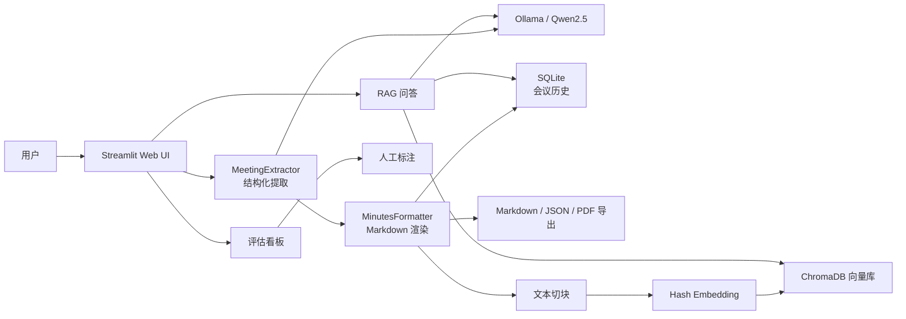

# 系统架构图

```mermaid
flowchart LR
    U["用户"] --> UI["Streamlit Web UI"]
    UI --> Extract["MeetingExtractor<br/>结构化提取"]
    Extract --> Ollama["Ollama / Qwen2.5"]
    Extract --> Format["MinutesFormatter<br/>Markdown 渲染"]
    Format --> SQLite["SQLite<br/>会议历史"]
    Format --> Export["Markdown / JSON / PDF 导出"]
    Format --> Chunk["文本切块"]
    Chunk --> Embed["Hash Embedding"]
    Embed --> Chroma["ChromaDB 向量库"]
    UI --> QA["RAG 问答"]
    QA --> Chroma
    QA --> Ollama
    QA --> SQLite
    UI --> Eval["评估看板"]
    Eval --> Labels["人工标注"]
```
